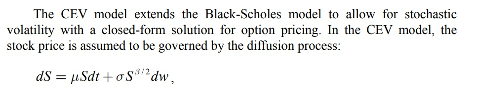

# CEV-model
The goal is to implement the valuation of European options in the so-called CEV
(Constant Elasticity Volatility) model, a simple extension of the Black-Scholes model specified by the
risk-free dynamics.
See notebook for output examples
https://github.com/joelcappelli/CEV-model/blob/main/main.ipynb

.

#### 1. Determine the analytical solution 
Value a European call under the CEV dynamics as a function of the spot S0, 𝜆, 𝛽, expiry 𝑇, and strike 𝐾 of the call.
Use the exact closed formula solution. An implementation of a displaced chi-square cumulative distribution is
necessary.

#### 2. Monte Carlo Solution
Implement a solution with Monte-Carlo simulations to price the option above. 
The goal is to design an object-oriented framework that is extendable to other models/options.
Things to think about
- discretisation step size
- log-transforming dynamics to ensure positivity
- parallelise using threads

#### 3. Finite Difference Method Solution
Use the Crank-Nicolson method to calculate prices to the price above.
Compare with the MC solution
- convergence of solution
- speed of execution
- margin of error to the exact analytical solution

